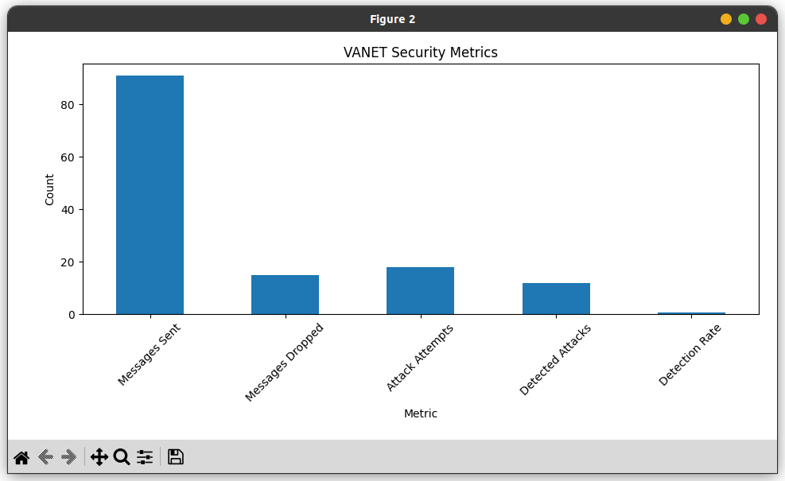

# VANET Security Prototype

A proof-of-concept implementation of secure message passing in Vehicular Ad-Hoc Networks (VANETs) using digital signatures and hash functions.


### Final Time Allocation
| Task | Time |
|------|------|
| Setup & Environment | 30m |
| Core Vehicle Class | 1h |
| Network Simulation | 2h |
| Demo Script | 1h |
| Testing & Debugging | 1h |
| Documentation | 2h |
| **Total** | **7.5h** |

This gives you time for breaks and final adjustments. The implementation demonstrates all key security aspects while being achievable in a single day.

## Features
- Vehicle-to-vehicle secure communication
- Digital signatures for authentication
- SHA-256 hashing for message integrity
- Attack simulations:
  - Message tampering detection
  - Impersonation attempt detection

## How It Works
1. Each vehicle has RSA public/private key pair
2. Messages are hashed and signed by sender
3. Recipients verify both hash and signature
4. Any modification invalidates the message

## Running the Demo
```bash
pip install cryptography
python demo.py


# Advanced VANET Security Simulator



*Example output visualization*

A comprehensive implementation of secure Vehicular Ad-Hoc Network (VANET) communications with advanced security features and attack simulations.

## Key Features

### Security Mechanisms
- **Hybrid Cryptography**
  - ECDSA for digital signatures
  - ECDHE for key exchange
  - AES-GCM for message encryption
  - PBKDF2 key derivation
- **Dynamic Trust Management**
  - Behavior-based reputation scoring
  - Adaptive message acceptance thresholds
  - Malicious node detection

### Network Components
- Realistic vehicle movement models
- Geographical routing with 300m range
- Periodic safety beacon broadcasts
- Neighborhood discovery protocol

### Attack Simulations
- **Sybil Attacks**: Fake identity generation
- **Greyhole Attacks**: Selective message dropping
- **Wormhole Attacks**: Message tunneling
- Configurable attack probabilities

### Performance Monitoring
- Real-time metrics collection
- Automated Pandas reporting
- Matplotlib visualizations